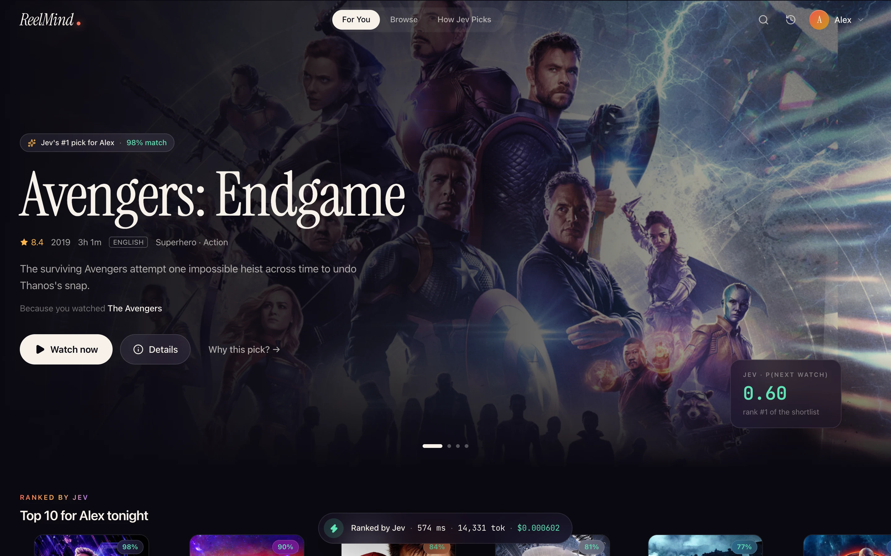
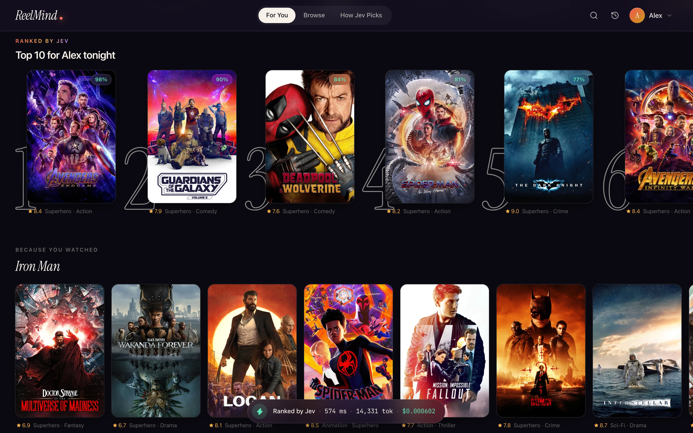
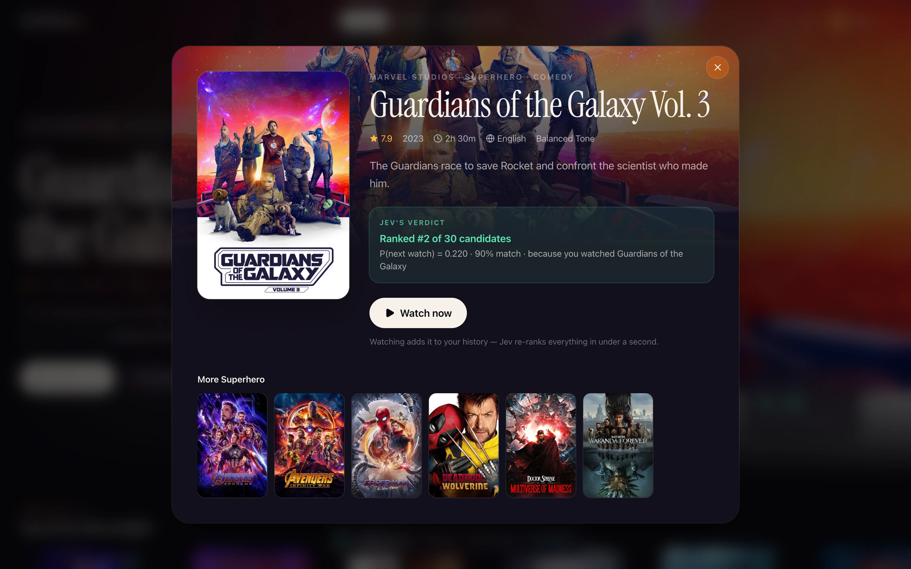
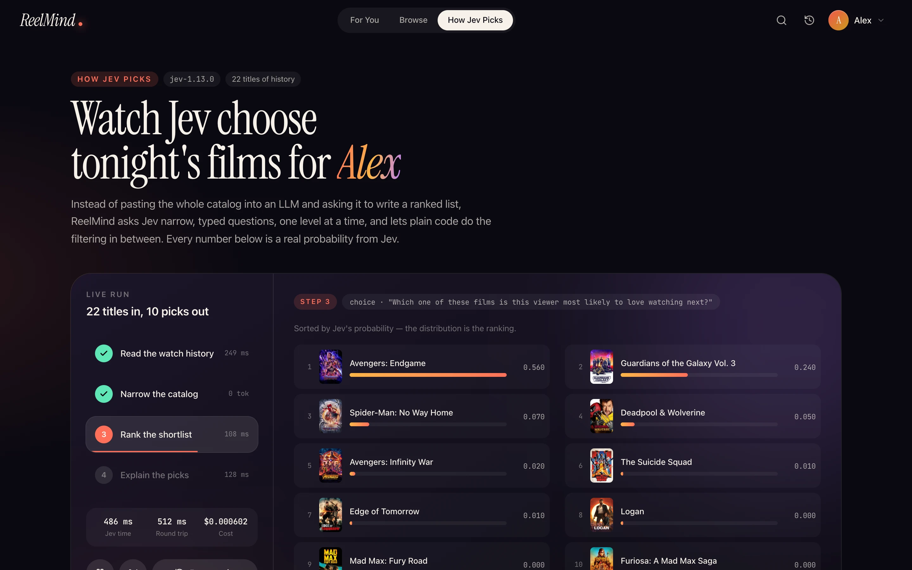

<!-- hero -->
<div align="center">

# ReelMind

**A streaming recommender powered by Jev**

A Netflix-style movie app whose recommendations come from Jev: four typed questions deep, ranked in about half a second, every pick explained.

     -7c3aed)



<sub>For You: Jev's #1 pick, with its probability</sub>

</div>

## Screenshots

| | |
|---|---|
|  |  |
| <sub>Top 10 for tonight, plus “Because you watched” rows</sub> | <sub>Every title carries Jev's verdict and rank</sub> |
|  | |
| <sub>How Jev Picks: the live run with real probabilities</sub> | |

## About

A Netflix-style movie app whose recommendations come from **TypeSafe's Jev** (a System One decision model, not an LLM).
Instead of pasting the whole catalog into a prompt, ReelMind asks Jev narrow, typed questions one level at a time
and lets plain code filter in between — the "hierarchical command resolution" idea from TypeSafe's IoT demos.

## Run it

```bash
npm install
cp .env.example .env.local   # add your TYPESAFE_API_KEY
npm run dev                  # http://localhost:3000
```

No key or no network? The app falls back to a local counting heuristic and says so in the UI.

## How a recommendation is made (`src/lib/recommend.ts`)

| Stage | What happens | Jev call |
| --- | --- | --- |
| 1 · Taste profile | Last ≤25 titles → one yes/no **affinity per genre** (11 Nouls), language (Choice), tone & era (Score), multilingual / acclaim / family (Noul) | 1 request, 17 questions fanned out |
| 2 · Hierarchical narrowing | Code keeps genres with affinity ≥ 0.5 (max 3), then languages covering 85% of probability; relaxes if <8 remain; family-safe rule; caps at 30 | none — 0 tokens |
| 3 · Rank | One Choice across the ≤30 candidates; the probability distribution *is* the ranking | 1 request |
| 4 · Explain & expand | "Because you watched…" — one Choice per top-5 pick over recent history, plus one Choice per anchor title over everything outside the Top 10 (so rows never repeat) | 1 request |

Typical run: **~300–500 ms, ~14k input tokens, ≈ $0.0006** (Jev bills $0.042 / M input tokens; output is free).

The **How Jev Picks** page (`/#how-jev-picks`) has a "Watch Jev pick" button that runs the pipeline live, then replays it
step by step with real posters: genre affinities filling in, the catalog dimming as filters apply, the shortlist re-sorting by
probability, and the final picks with their "because you watched" links. Below it: per-stage latency, the funnel, raw
probabilities, the exact request JSON, and a scaling comparison against a brute-force LLM prompt (estimated at $3 / $15 per M
tokens, ~75 tok/s).

## What's in the box

- 88 streaming titles (Marvel & DC, Netflix originals, Hollywood, A24, Pixar, Ghibli, a few world-cinema picks) + 132 archive titles (`src/lib/catalog.ts`)
- 6 viewer profiles with varied 22-title histories (Marvel-first Alex, sci-fi Emma, horror Jordan, rom-com Chloe, thriller Sophie, the family Parkers) plus a blank "New viewer" onboarding flow
- Real posters and backdrops from TMDB (`src/lib/images.json`, hot-linked from media.themoviedb.org; this product uses TMDB images but is not endorsed or certified by TMDB)
- Watch a film or remove one from history → Jev re-ranks instantly
- Next.js 16 · React 19 · Tailwind v4 · Framer Motion · Instrument Serif + SF Pro
